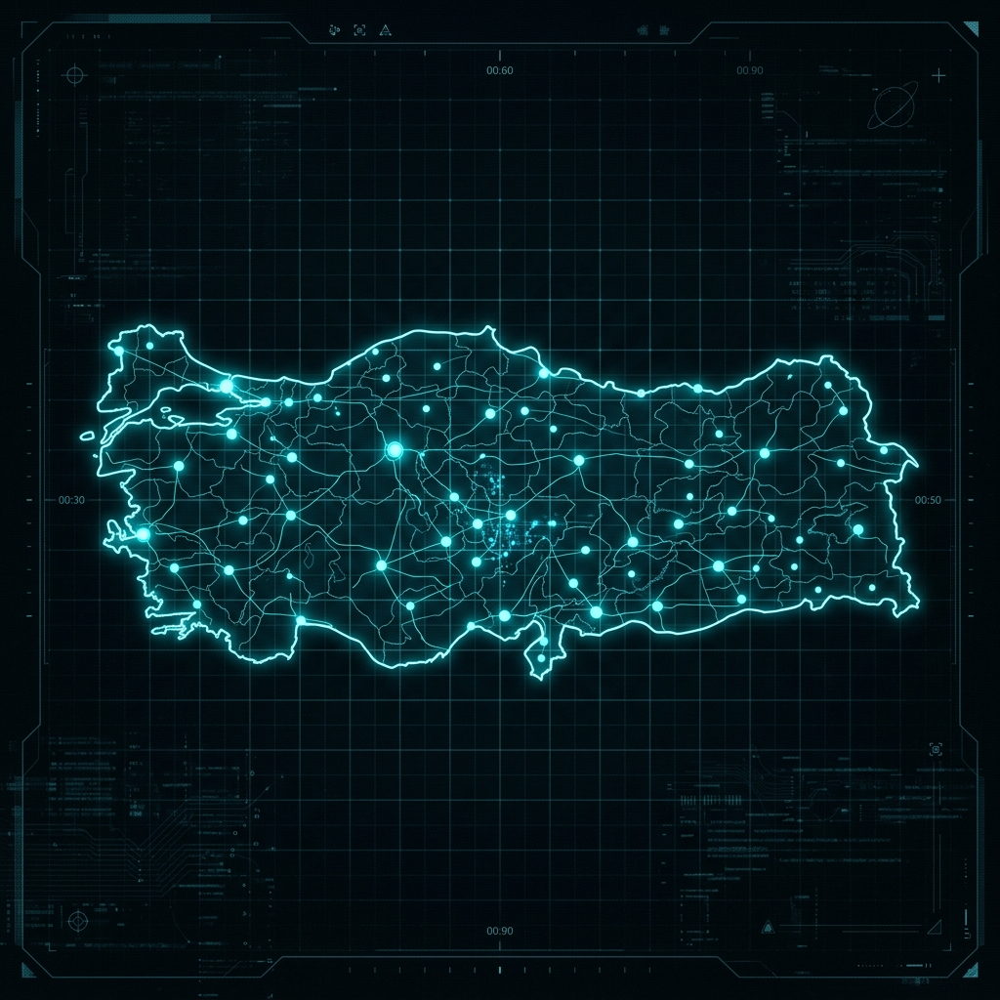

# 🌌 ORBITA-R: Bölgesel Uydu Takımı Optimizasyon Sistemi

<div align="center">
  
  <p><b>Yapay Zeka Destekli Bölgesel Uydu Takımı Tasarım ve Karar Destek Platformu</b></p>
</div>

---

## 🔭 Vizyonumuz

Uzay teknolojilerine erişimi demokratikleştirerek, her bölgenin ve her görevin kendine özgü ihtiyaçlarına en verimli, dayanıklı ve optimize edilmiş uydu takımı çözümleriyle yanıt veren dünyanın öncü karar destek sistemi olmak.

## 🎯 Misyonumuz

Karmaşık yörünge mekaniği hesaplamalarını, yerel yapay zeka analizi ve etkileşimli 3D görselleştirme ile birleştirerek; kurumların ve araştırmacıların belirli coğrafi bölgeler için 7/24 kesintisiz kapsama sağlayacak en düşük maliyetli ve en yüksek performanslı uydu takımlarını tasarlamalarına, simüle etmelerine ve analiz etmelerine olanak sağlamak.

---

## 🚀 Proje Genel Özeti

**ORBITA-R**, sadece uydu yerleştirmekten ziyade; maliyet, kapsama genişliği (coverage), boşluk süresi (gap duration), dayanıklılık ve sistemin arıza toleransı arasında denge kurarak "En iyi yörünge dizilimi nedir?" sorusuna bilimsel ve veriye dayalı yanıtlar veren bir sistemdir.

### Ana Çalışma Modları
1. **Mission-Based Design (Görev Bazlı Tasarım):** Kullanıcı tanımlı bölge (koordinat, poligon) ve uydu kabiliyetleri üzerinden sıfırdan Walker-Delta veya özel konstellasyon mimarileri üretir.
2. **Real-World Scenario (Gerçek Dünya Senaryoları):** Mevcut aktif yörünge araçları veya tanımlı uydu setleri üzerinden, afet veya kesinti anlarında en iyi kapsama ve yönlendirme planını (manevra önerileri dahil) hesaplar.

---

## ✨ Temel Özellikler

*   **📐 Orbital Engine (Fizik Motoru):** Parametrik hesaplamalarla en uygun irtifa (altitude), eğim (inclination) ve düzlem (plane) dağılımını belirler.
*   **📡 Kapsama (Coverage) Analizi:** 24 saatlik simülasyonlarla süreklilik, yeniden ziyaret süresi (revisit) ve en kötü boşluk süresi (worst-gap) analizi yapar.
*   **🛡️ Risk ve Arıza Simülasyonu:** Uydu kayıpları veya karartma bölgeleri (blackout zones) durumunda sistemin performans düşüşünü (degradation) ölçer.
*   **🤖 NLP Destekli Yorumlama:** Karmaşık mühendislik sonuçlarını, yerel çalışan **Gemma-2-2B-IT** modeli ile herkesin anlayabileceği taktiksel raporlara dönüştürür.
*   **🎮 Taktiksel 3D Kontrol Paneli:** Three.js tabanlı, siber-estetik HUD (Heads-Up Display) arayüzü ile gerçek zamanlı görselleştirme sağlar.

---

## 🛠️ Teknoloji Yığını (Tech Stack)

### Backend (Gövde)
- **Dil:** Python 3.10+
- **Framework:** [FastAPI](https://fastapi.tiangolo.com/) & Uvicorn (Asenkron mimari)
- **Matematik & Fizik:** NumPy, PyProj, Shapely (Yörünge mekaniği ve coğrafi hesaplamalar)
- **YZ:** `llama-cpp-python` (Cihaz üstü LLM çıkarımı)

### Frontend (Kontrol Merkezi)
- **Framework:** [Next.js 16](https://nextjs.org) (App Router) & React 19
- **3D Görselleştirme:** [React Three Fiber](https://docs.pmnd.rs/react-three-fiber) & Three.js
- **Stil & Animasyon:** Tailwind CSS 4 & Framer Motion
- **Durum Yönetimi:** Zustand

### Altyapı & Güvenlik
- **Veritabanı & Auth:** [Supabase](https://supabase.com/) (PostgreSQL & JWT)
- **Güvenlik:** RSA-8192 seviyesinde şifreleme simülasyonu ve güvenli API katmanı

---

## 📂 Proje Yapısı

```text
kodera/
├── backend/                # Python FastAPI Uygulaması
│   ├── app/
│   │   ├── api/            # Route tanımları (auth, design, maneuver, risk...)
│   │   ├── core/           # Yapılandırma ve güvenlik
│   │   ├── db/             # Supabase entegrasyonu
│   │   └── services/       # İş mantığı ve Orbital Engine
│   └── requirements.txt    # Bağımlılıklar
├── frontend/               # Next.js Web Uygulaması
│   ├── app/                # Sayfalar ve rotalar
│   ├── components/         # 3D Sahne ve HUD bileşenleri
│   └── lib/                # API istemcisi ve store
└── models/                 # Yerel LLM ağırlıkları (Gemma GGUF)
```

---

## 📥 Hızlı Başlangıç

1.  **Backend'i Çalıştırın:**
    ```bash
    cd backend
    python -m venv venv
    .\venv\Scripts\activate
    pip install -r requirements.txt
    uvicorn app.main:app --reload --port 8000
    ```

2.  **Frontend'i Çalıştırın:**
    ```bash
    cd frontend
    npm install
    npm run dev
    ```

3.  **Tarayıcıda Açın:** `http://localhost:3000`

---

## 📍 Temel API Endpointleri

| Metod | Yol | Görev |
| :--- | :--- | :--- |
| `POST` | `/api/v1/auth/login` | Güvenli operatör girişi |
| `POST` | `/api/v1/design/run` | Konstellasyon optimizasyonunu başlatır |
| `POST` | `/api/v1/maneuver/optimize` | Uydu konumlandırma ve manevra planı üretir |
| `POST` | `/api/v1/risk/failure` | Arıza senaryosu analizi yapar |

---

<p align="center">
  <i>"Uzay mühendisliği ve yapay zekanın kesişim noktasında, yörüngedeki geleceğinizi tasarlayın."</i>
  <br>
  <b>Developed for Outer-Space Engineering Logic!</b>
</p>
