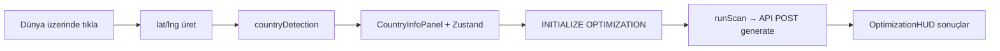

# PRISM Orbit Command — Frontend Sunumu

Bu doküman, **Kodera** deposundaki `frontend` uygulamasının teknik ve ürün odaklı özetidir. Sunum veya arkadaşınla paylaşım için hazırlanmıştır.

---

## 1. Ürün özeti

**PRISM Orbit Command**, uzay operasyonları estetiğinde tasarlanmış bir **görev kontrol arayüzüdür**. Kullanıcı üç boyutlu Dünya üzerinde bölge seçer; arka planda **ORBITA-R** backend’i ile konstellasyon / kapsama optimizasyonu tetiklenir ve sonuçlar “taktiksel HUD” panellerinde gösterilir.

| Özellik | Açıklama |
|--------|-----------|
| **3D Dünya** | WebGL (Three.js) ile dönen gezegen, yıldız alanı, yörünge halkaları |
| **Bölge seçimi** | Yüzeye tıklayınca yaklaşık ülke / bölge tespiti (`countryDetection`) |
| **Optimizasyon taraması** | Seçilen bölge için API’ye `OrbitDesignRequest` benzeri gövde gönderilir |
| **Sonuç HUD’u** | İlerleme, metrikler ve (backend şifreliyse) çözüm sonrası veri akışı |
| **Kimlik / profil** | Token ile `/auth/me` (yapı hazır); giriş sayfası ayrı rota |

---

## 2. Teknoloji yığını

| Katman | Teknoloji | Sürüm notu |
|--------|-----------|------------|
| **Framework** | [Next.js](https://nextjs.org) (App Router) | `16.x` |
| **UI** | React | `19.x` |
| **Stil** | Tailwind CSS | `4.x` |
| **3D** | Three.js + [@react-three/fiber](https://docs.pmnd.rs/react-three-fiber) + [@react-three/drei](https://github.com/pmndrs/drei) | R3F `9.x` |
| **Post-processing** | `@react-three/postprocessing` | Bloom vb. |
| **Animasyon** | Framer Motion | `12.x` |
| **Durum** | Zustand | `5.x` |
| **Dil** | TypeScript | `5.x` |

**Neden R3F?** React bileşen modeli ile sahne grafiğini birleştirir; `Canvas` içinde `Earth`, `OrbitalSystem`, ışık ve kontroller declarative yazılır.

---

## 3. Klasör yapısı (özet)

```
frontend/
├── app/                    # Next.js App Router sayfaları
│   ├── page.tsx            # Ana gösterge paneli (3D + HUD)
│   ├── layout.tsx          # Kök layout, metadata
│   ├── globals.css         # Global stiller
│   ├── login/page.tsx      # Giriş ekranı (3D arka plan)
│   ├── scan/page.tsx       # Tarama / sonuç odaklı alt sayfa
│   └── profile/page.tsx    # Profil
├── components/             # Yeniden kullanılabilir UI + 3D
│   ├── Scene.tsx           # Ana Canvas, OrbitControls, Earth, OrbitalSystem
│   ├── Earth.tsx           # Dünya mesh + tıklama → lat/lng
│   ├── OrbitalSystem.tsx   # Uydu / halka görselleştirme
│   ├── OptimizationHUD.tsx # Optimizasyon sonuçları paneli
│   ├── CountryInfoPanel.tsx
│   ├── Header.tsx, StatusBar.tsx, ProfilePanel.tsx
│   └── ...
├── lib/
│   ├── api.ts              # Backend HTTP istemcisi
│   ├── store.ts            # Zustand global state + runScan
│   └── countryDetection.ts # Lat/lng → ülke/bölge tahmini
├── public/                 # Statik assetler
├── package.json
└── next.config.ts
```

---

## 4. Sayfa rotaları

| Rota | Dosya | Amaç |
|------|--------|------|
| `/` | `app/page.tsx` | Ana deneyim: boot animasyonu, 3D sahne, paneller |
| `/login` | `app/login/page.tsx` | Giriş (şu an form sonrası `/` yönlendirmesi) |
| `/scan` | `app/scan/page.tsx` | Tarama / log odaklı görünüm |
| `/profile` | `app/profile/page.tsx` | Kullanıcı profili |

---

## 5. Kullanıcı akışı (ana senaryo)



1. **Scene** içinde `Earth` tıklanınca `lat`, `lng` hesaplanır.
2. **`detectCountry(lat, lng)`** ile panelde ülke adı, bölge vb. doldurulur (`CountryData`).
3. Kullanıcı **“INITIALIZE OPTIMIZATION”** der.
4. **`runScan`** (`lib/store.ts`) sabitlenmiş bir **payload** ile `api.generateConstellation` çağırır:
   - `region`: `point_radius`, seçilen ülkenin `lat`/`lng`, `radius_km: 1000`
   - `mission`: `missionMode` (store), sürekli kapsama, ufuk süreleri
   - `sensor_model`, `optimization` (LEO, hedefler, limitler)
5. Dönen cevap `scanResult` olarak saklanır; **OptimizationHUD** gösterilir.

---

## 6. Backend entegrasyonu (`lib/api.ts`)

**Taban URL:** `process.env.NEXT_PUBLIC_API_URL` yoksa `http://localhost:8000`.

| Metod | Endpoint | Görev |
|--------|-----------|--------|
| `POST` | `/api/v1/design/generate` | Konstellasyon tasarımı (OrbitalEngineFacade → design_module) |
| `POST` | `/api/v1/design/reposition` | Uydu yeniden konumlandırma senaryosu |
| `POST` | `/api/v1/design/decrypt` | Şifrelenmiş sonuç paketini çöz |
| `GET` | `/api/v1/auth/me` | Bearer token ile profil |

**Önemli:** Backend tasarım cevabında sonuçlar **şifreli** (`encrypted_data`) dönebilir; tam metrikler için `decrypt` akışı veya ham önizleme alanları kullanılır. Frontend HUD, `scanResult` yapısına göre genişletilmelidir.

---

## 7. Global durum (`lib/store.ts`)

Zustand ile tutulan başlıca alanlar:

- **Dünya:** `selectedCountry`, `cameraZoomed`, `showClouds`, sürükleme durumları
- **Görev:** `missionMode` (`BALANCED` | `EMERGENCY_COMMS` | `EARTH_OBSERVATION` | `BROADCAST`)
- **Tarama:** `isScanning`, `scanResult`, `scanError`
- **UI:** `showOptimizationResults`, `aiGenesisActive`
- **Uydu görselleştirme:** `satelliteActive`, `activeSatelliteId`

**Aksiyonlar:** `runScan`, `resetScan`, setter’lar.

---

## 8. 3D sahne mimarisi

- **`Scene.tsx`:** `Canvas` + `OrbitControls` (seçim varken dönüş kısıtı), `Stars`, **Bloom** post-processing.
- **`Earth.tsx`:** Küre; tıklamada raycast ile yüzey `lat/lng`.
- **`OrbitalSystem.tsx`:** Yörünge halkası / uydu göstergeleri (görsel katman).
- **SSR:** Three.js tarafı `dynamic(..., { ssr: false })` ile ana sayfada yüklenir (hydration uyumu).

---

## 9. Tasarım dili

- **Renk:** Koyu uzay arka planı, cam efektli paneller (`glass-panel`), **cyan / teal** vurgular (`#00f5ff`).
- **Tipografi:** Orbitron benzeri başlıklar, monospace “teknik” etiketler.
- **Animasyon:** Boot sequence, Framer Motion geçişleri, tarama sırasında yapay ilerleme çubuğu (OptimizationHUD).

---

## 10. Yerel çalıştırma

```bash
cd frontend
npm install
npm run dev
```

Tarayıcı: `http://localhost:3000`

Backend ayrıca çalışıyorsa (ör. `http://localhost:8000`), `.env.local` içinde:

```env
NEXT_PUBLIC_API_URL=http://localhost:8000
```

---

## 11. Bilinen sınırlar ve geliştirme fikirleri

| Konu | Durum |
|------|--------|
| **Harita çözünürlüğü** | Ülke konumu `countryDetection` ile yaklaşık; hassas AOI için poligon veya kullanıcı tanımlı yarıçap iyileştirilebilir. |
| **Payload** | `runScan` içinde `radius_km` ve görev parametreleri sabit / store tabanlı; tam form ile kullanıcı girdisi eklenebilir. |
| **Şifreli yanıt** | `generate` cevabı şifreliyse UI’da `decrypt` ile açılıp gösterilmeli. |
| **Auth** | Login sayfası demo yönlendirme; gerçek JWT akışı backend `auth` ile bağlanmalı. |
| **Erişilebilirlik** | Yüksek kontrast ve klavye ile kontrol ileride iyileştirilebilir. |

---

## 12. Özet cümle

**PRISM Orbit Command** frontend’i; **Next.js 16 + React 19 + Three.js** ile sinematik bir **uzay görev kontrolü** sunar, kullanıcı etkileşimini **Zustand** ile yönetir ve **ORBITA-R** backend’indeki **bölgesel konstellasyon optimizasyonu** ile konuşur. Sunumda vurgulanabilecek ana mesaj: *“3D etkileşim + gerçek optimizasyon API’si + taktiksel operasyonel UI.”*

---

*Son güncelleme: repo `frontend/` yapısına göre üretilmiştir; backend rotaları `backend/app/main.py` ile uyumludur.*
